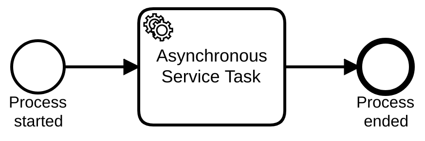

# Asynchronous Service Task

> **Warning:** this example demonstrates an advanced usage pattern of the process engine based on internal (non-public) API. Similar behavior can be achieved using a send task and a receive task. The latter option is recommended in most usecases.

An asynchronous Service Task example for [Camunda BPM](http://docs.camunda.org) using a scheduled executor.

This example has been derived from: https://github.com/camunda/camunda-bpm-examples/tree/master/servicetask/service-invocation-asynchronous

This project has been originally generated by the Maven archetype
[camunda-archetype-servlet-war-7.10.1-SNAPSHOT](http://docs.camunda.org/latest/guides/user-guide/#process-applications-maven-project-templates-archetypes).

## Show me the important parts!
[BPMN Process](src/test/resources/process.bpmn)



## How does it work?

[AsynchronousServiceTask](src/main/java/org/camunda/bpm/extension/bpmn/servicetask/asynchronous/AsynchronousJavaDelegate.java)

## How to use it?

### Unit Test
You can run the JUnit test [InMemoryH2Test](src/test/java/com/camunda/bpm/consulting/snippet/asynchronous_service_task/InMemoryH2Test.java) in your IDE or using:

```bash
mvn clean test
```

## Environment Restrictions
Built and tested against Camunda BPM version 7.12.0.

## Known Limitations

## License
[Apache License, Version 2.0](http://www.apache.org/licenses/LICENSE-2.0).

<!-- Tweet
New @Camunda example: Asynchronous Service Task - An asynchronous Service Task example for [Camunda BPM](http://docs.camunda.org) using a scheduled executor. https://github.com/camunda-consulting/code/tree/master/snippets/asynchronous-service-task
-->
